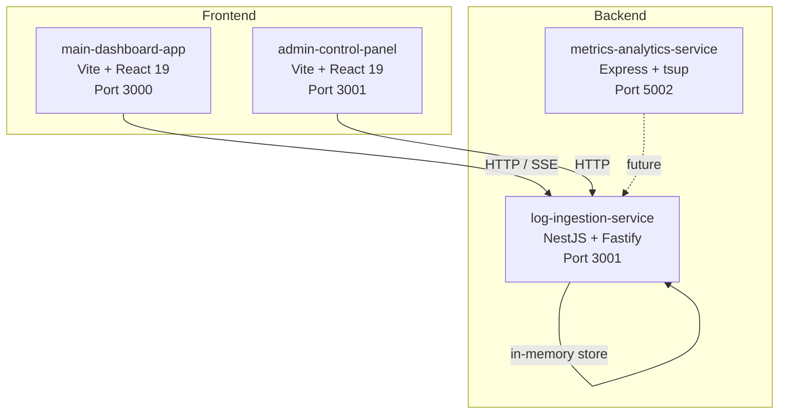

# StapelFeed


> Real-time log ingestion, metrics analytics, and dashboard visualization platform.

A Turborepo-powered monorepo housing a distributed microservices architecture with a React dashboard frontend and NestJS/Express backend services. Built for scalability, strict TypeScript safety, and CI/CD readiness.

## **[Live Demo]()** | **[API Documentation]()**

## Architecture



| Package                     | Role                              | Stack                                      | Port | Tests                    |
| --------------------------- | --------------------------------- | ------------------------------------------ | ---- | ------------------------ |
| `main-dashboard-app`        | Developer dashboard UI            | Vite, React 19, Tailwind 4, TanStack Query | 3000 | Vitest + Testing Library |
| `admin-control-panel`       | Admin configuration UI            | Vite, React 19                             | 3001 | —                        |
| `log-ingestion-service`     | Log ingestion & SSE streaming API | NestJS 11, Fastify, Zod                    | 3001 | Vitest                   |
| `metrics-analytics-service` | Metrics & analytics REST API      | Express 4, tsup                            | 5002 | —                        |

---

## Tech Stack

| Tool               | Purpose                                   |
| ------------------ | ----------------------------------------- |
| **React 19**       | Frontend UI framework                     |
| **NestJS 11**      | Backend API framework (Fastify)           |
| **Turborepo**      | Monorepo orchestration & caching          |
| **npm workspaces** | Package dependency linking                |
| **TypeScript**     | Strict type safety across all packages    |
| **Vitest**         | Unit & integration test runner            |
| **tsup**           | Fast TypeScript bundler (metrics service) |
| **Docker Compose** | PostgreSQL 18 (production data store)     |

---

## Getting Started

### Prerequisites

- Node.js 20+
- npm 10+
- Docker Desktop (for PostgreSQL)

### Setup

```bash
# 1. Install dependencies
npm install

# 2. Start PostgreSQL (optional, for service development)
docker compose up -d

# 3. Copy environment template
cp .env.example .env
```

### Development

```bash
# Run all apps in parallel (turbo)
npm run dev

# Run a specific app
npm run dev --filter=main-dashboard-app
npm run dev --filter=log-ingestion-service
```

---

## Monorepo Pipelines

All commands are routed through Turborepo for parallel execution and caching.

```bash
# Build all packages
npm run build

# Type-check all packages
npm run check-types

# Run all test suites
npm run test

# Lint all packages (non-blocking)
npm run lint

# Full CI pipeline
npx turbo run build check-types test lint --continue
```

### Pipeline DAG (as defined in `turbo.json`)

```
        ┌──────────┐
        │  build   │ (cached, depends on ^build)
        └────┬─────┘
             │
     ┌───────┼───────────┐
     ▼       ▼           ▼
┌────────┐ ┌─────┐ ┌──────────┐
│  test  │ │lint │ │check-types│
└────────┘ └─────┘ └──────────┘
```

- `build` runs first (with topological dependency ordering)
- `test`, `lint`, and `check-types` run in parallel after build
- `lint` uses `--continue` so formatting issues never block the pipeline
- `test` is uncached (always runs fresh)
- Turborepo artifacts are cached in `.turbo/` for fast CI restores

### CI (GitHub Actions)

The `.github/workflows/ci.yml` workflow runs on every push/PR to `main` or `dev`:

```yaml
npx turbo run build check-types test lint --continue
```

Caching layers:

- `npm` dependency cache
- Turborepo `.turbo` artifact cache (keyed by commit SHA)

---

## Project Structure

```
StapelFeed/
├── apps/
│   ├── admin-control-panel/     # React 19 admin UI (Vite)
│   ├── log-ingestion-service/   # NestJS + Fastify log API
│   ├── main-dashboard-app/      # React 19 dashoard (Vite)
│   └── metrics-analytics-service/ # Express metrics API (tsup)
├── .github/workflows/
│   ├── ci.yml                   # Main CI pipeline
│   └── ai-review.yml            # Gemini-powered PR review
├── eslint.config.js             # Shared ESLint flat config
├── turbo.json                   # Turborepo task definitions
├── docker-compose.yml           # PostgreSQL 18 service
└── package.json                 # Root workspace config
```

## Developed By

| Name                 | Role          | Links                                                                                             |
| :------------------- | :------------ | :------------------------------------------------------------------------------------------------ |
| **Pratyusha Dasari** | Web Developer | [GitHub](https://github.com/pratyusha-ds) / [LinkedIn](https://www.linkedin.com/in/pratyusha-ds/) |

## License

This project is licensed under the MIT License - see the [LICENSE](https://opensource.org/license/mit/) file for details.
